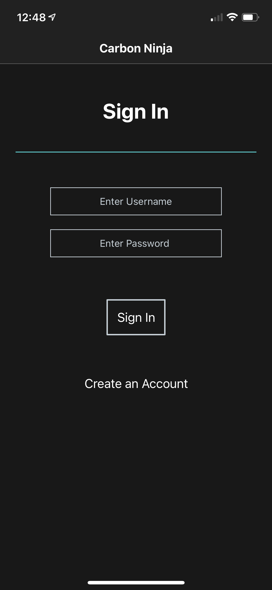
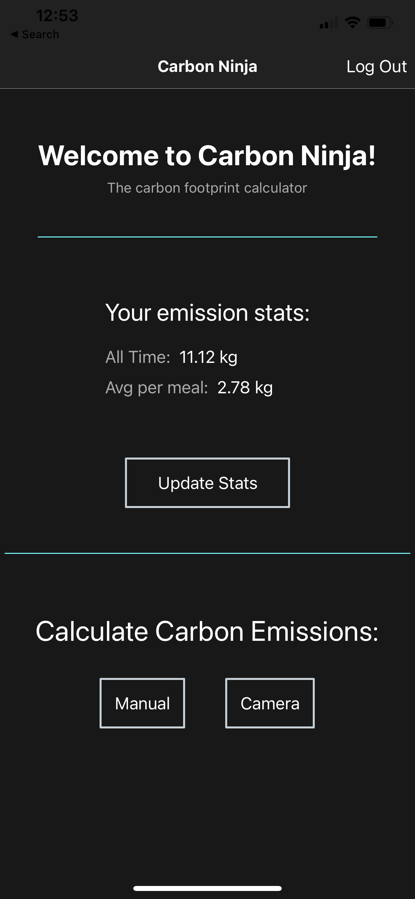
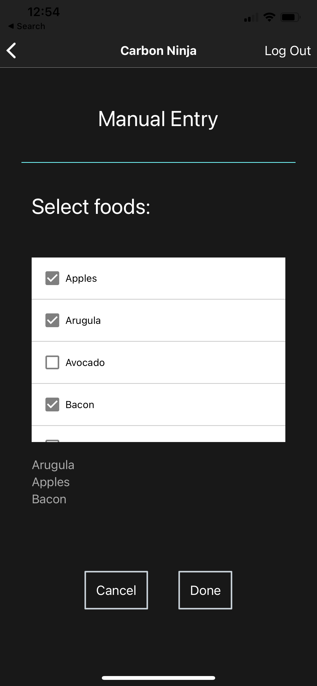
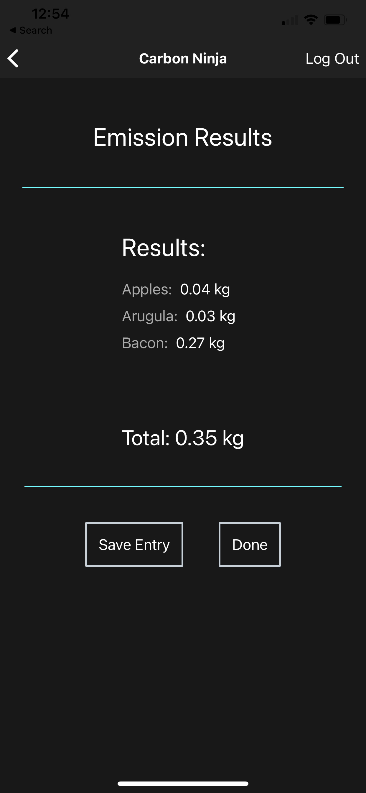
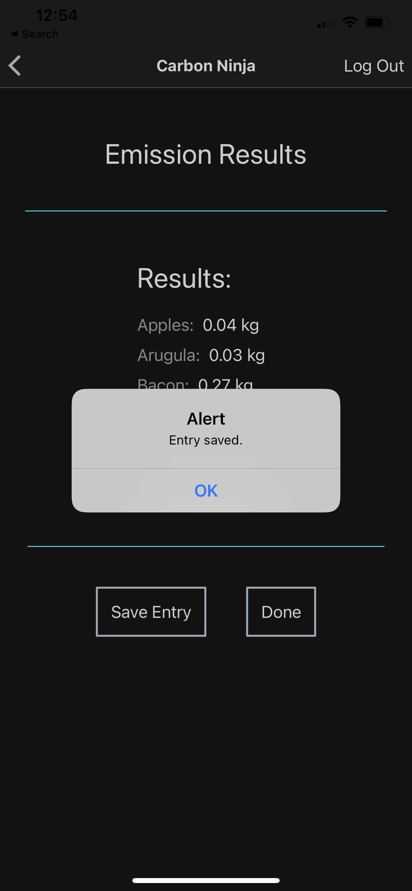
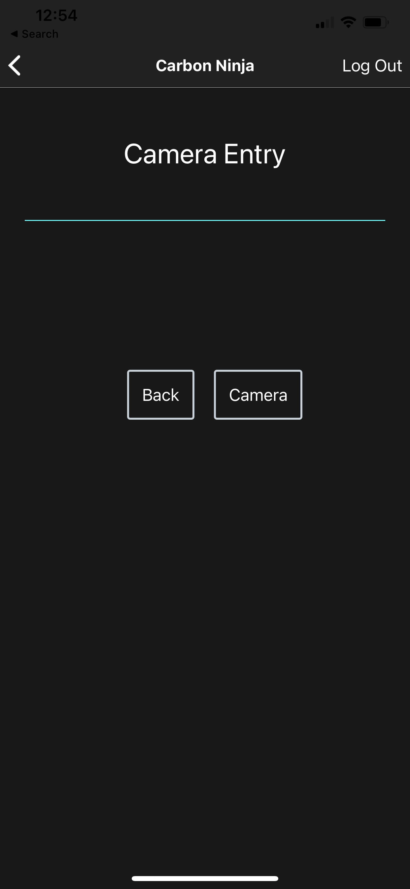

# Carbon Ninja

Carbon Ninja is a mobile application created to make it easy for people to track the carbon emissions associated with their regular diet. Within the app, users can snap a picture of their meal and receive feedback regarding the carbon footprint of items on their plate. Carbon Ninja does this using IBM Visual Recognition models in conjunction with publicly available carbon emission statistics for common food products.

---
## Table of Contents

1. [Why It Matters](#why-it-matters)
2. [Installation](#installing-carbon-ninja-beta-application)
3. [Running Locally](#running-carbon-ninja-locally)
4. [Why You Should Contribute](#why-you-should-contribute)
5. [Technology Used](#technology-used)
6. [Usage](#using-carbon-ninja)
    - [Create Account / Sign In](#create-an-account-andor-sign-in) 
    - [Choose Entry Type](#choose-your-entry-type-on-the-landing-page-or-check-out-your-stats) 
    - [Manual Entry](#manual-entry) 
    - [Camera Entry](#camera-entry)   
7. [Demo](#demo)
8. [Metrics](#carbon-ninja-metrics)
9. [Road Map](#carbon-ninja-road-map)
---

## Why It Matters

Do you know how much your daily life impacts the climate? The answer might surprise you. The average US citizen has a carbon footprint of around 36,000 pounds a year – one of the highest figures in the world. Although we’ve made great strides to address pollution, encourage recycling, reduce consumption, and use cleaner energy, there is still a significant challenge ahead of us. We are still seeing increases in temperatures, extinction, sea levels, extreme weather events, and other natural dangers due to increasing carbon emissions. While the fight against climate change requires cooperation between nations, governments, and large corporations, many significant changes come down to our individual choices. 

The major contributors to carbon footprints are food, consumption, transportation, and household energy. Researchers have revealed the climate impact of our food production and consumption, showing that food systems generate 34% of all human-made greenhouse gas emissions. Livestock is a significant contributor to carbon footprints, with beef being one of the most significant contributors. 

Currently, there is not enough awareness of the carbon footprint left by human beings and our impact at the individual level. To bring more awareness to transportation emissions, the FAA started tracking emissions to lower the carbon emissions left by aircrafts in 2015. The movement brought attention to detrimental aircraft emission values and has enabled the FAA to target significant emitters and decrease carbon levels by about 8% in seven years. Our application, Carbon Ninja, aims to parallel the FAA’s movement by bringing awareness to individuals’ food consumption footprint and offering personalized solutions to reduce it. We intend this technology to integrate into people's daily lives, so they are more aware of their carbon footprint and enabled to reduce it.

---

## Installing Carbon Ninja Beta Application

At this time, Carbon Ninja is not available in the App Store or Google Play Store, but you can beta test the app using Expo Go!

1. Install Expo Go from the App Store (iOS) or Google Play Store (Android)
2. Login as a Call for Code tester: **callforcode** / **CallForCode2021**
3. Scan the QR code at our [Expo URL](https://expo.io/@kness/carbon-ninja)

The app should begin to download and you're all set! Create a user account in the Carbon Ninja app and starting tracking your carbon emissions.

---

## Running Carbon Ninja Locally

1. Open a terminal session
2. Install npm and Expo if not already installed
  ```brew install node```
  ```npm i -g expo-cli```
3. ```cd``` into ```carbon-ninja/carbon-ninja```
4. Run ```npm install```
5. Run ```npm start```
6. In a separate terminal, ```cd``` into ```carbon-ninja/carbon-ninja``` and run ```expo start```
7. Click `W` to open the application in the web

To run on a mobile device, install Expo Go from the App Store (iOS) or Google Play Store (Android). After installation, scan the QR code produced by step 6. 

---


## Why You Should Contribute

The way we treat our environment has huge consequences for the future of our planet. It affects everything from human health to the well-being of our wildlife. We can all do our part in protecting the Earth we live on. If we all make an effort to become more environmentally conscious, we can make the world a better place. Contributing to this application will allow us to interactively  

---

## Technology Used

Carbon Ninja aims to tackle carbon emissions contributed by the food industry by informing users of their carbon footprint based on a photo of a plate of food taken. Carbon Ninja runs a **React Native Expo** application inside a container in **OpenShift**. Upon opening, the application prompts the user to take a photo of their meal or manually enter their food data. Once entered, the application utilizes **IBM Watson’s** image recognition service in conjunction with data relating carbon emission values to common food groups and outputs the total carbon footprint created from that meal. Specifically, the application finds carbon emission values by feeding the list of foods outputted by the POST request to Watson’s image processing algorithm and returns the object containing the emissions value. Carbon emission data is then stored inside a **MariaDB** pod running on OpenShift and is available to the user at any time. Over multiple image entries, the application logs carbon emission values so that the user can visualize their footprint over time. 

---

## Using Carbon Ninja

### Create an account and/or Sign In 


### Choose your entry type on the landing page or check out your stats


### Manual Entry

1. Create an Entry
2. Save Entry
3. Confirm (via Success Alert)

   
   
   

### Camera Entry

1. Select Camera
2. Capture Photo
3. Save Entry
4. Confirm (via Success Alert)

   
   
   
   

---
## Demo

[](https://www.youtube.com/watch?v=DEpSei0nMQM "Carbon Ninja Demo")

---

## Carbon Ninja Metrics

When viewing emission results, you will see the unit "kg" to measure your carbon footprint. The current calculation behind the resulting "kg" looks like the following:

`kg of CO2 emitted for your meal =`

`(food_1_avg_serving_kg * kg_CO2_per_kg_food_1)`

`+ ... +` 

`(food_n_avg_serving_kg * kg_CO2_per_kg_food_n)`

In the future, we hope to improve our AI capabilities to detect portion sizes in the photo submitted. Until then, we will use the average serving size to give you a reasonable estimate!

Dataset used: https://www.kaggle.com/selfvivek/choose-your-food-wisely/data

---

## Carbon Ninja Road Map

Interesting in knowing what's coming? Check out our [Road Map](https://docs.google.com/spreadsheets/d/e/2PACX-1vQ_STHaevz4K3mBYx54T-92LWJH_O68pPTnm4RLY1IRrukQ655fBoCtvf9X3dcizZP62Wq7J-G3SBiP/pubhtml?gid=0&single=true)!